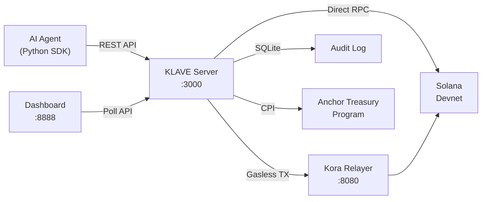

# KLAVE

**Agentic wallet infrastructure for Solana.** Create wallets for AI agents, enforce per-agent policies, execute gasless transactions, swap tokens, and manage liquidity — all through a single REST API.

## Highlights

- **Multi-agent from day one** — each agent gets its own keypair, policy, and audit trail
- **Gasless transactions** — all on-chain operations routed through [Kora](https://github.com/kora-labs/kora) (no SOL needed for fees)
- **Orca DeFi engine** — agents can swap tokens, provide concentrated liquidity, and harvest rewards
- **Policy enforcement** — per-agent spend limits, program allowlists, token restrictions, and withdrawal destinations
- **Live dashboard** — retro brutalist monitoring UI with real-time agent status and transaction feed
- **One-command setup** — `klave init && klave start`

## Architecture



## Prerequisites

- [Rust](https://rustup.rs/) (stable)
- [Solana CLI](https://docs.solanalabs.com/cli/install) with a configured keypair
- [Kora](https://github.com/kora-labs/kora) (`cargo install kora`)
- [Anchor CLI](https://www.anchor-lang.com/docs/installation) (for deploying the treasury program)
- Python 3.11+ (for the agent SDK)

## Quick Start

```bash
# 1. Clone
git clone https://github.com/iamprecieee/klave.git && cd klave

# 2. Install the CLI
cargo install --path ./klave-cli

# 3. Initialize — generates .env with all secrets
klave init

# 4. Fund the Kora signer (devnet)
solana airdrop 2 $(grep KORA_PUBKEY .env | cut -d= -f2) --url devnet

# 5. Start everything
klave start --with-kora --dashboard
```

The server is now running:

- **API**: http://localhost:3000
- **Kora**: http://localhost:8080
- **Dashboard**: http://localhost:8888

## CLI Reference

```
klave init                              # Generate .env with random secrets
klave start                             # Build + start klave-server only
klave start --with-kora                 # Also start Kora gasless relayer
klave start --dashboard                 # Also serve dashboard on :8888
klave start --with-kora --dashboard     # Everything
klave start --release                   # Production build
klave deploy                            # anchor build + deploy to devnet
klave deploy --cluster localnet         # Deploy to localnet
```

## Project Structure

```
klave/
├── klave-cli/          # CLI binary (init, start, deploy)
├── klave-core/         # Core library (agent registry, policy engine, audit log, Kora gateway, Orca client)
├── klave-server/       # Axum HTTP server (handlers, router, middleware)
├── klave-anchor/       # Anchor treasury program (initialize_vault, deposit, withdraw)
├── sdk/                # Python SDK + agent demo script
│   ├── klave/          # KlaveClient, models, LangChain tools
│   └── tests/
├── dashboard/          # Single-file HTML monitoring UI
├── docs/               # PRD, implementation plan, challenge spec
├── SKILLS.md           # Agent-facing API reference
├── .env.example        # Environment template
├── kora.toml           # Kora relayer configuration
└── signers.toml        # Kora signer pool configuration
```

## Using the Python SDK

The SDK provides a typed `KlaveClient` and LangChain-compatible tool wrappers:

```bash
cd sdk && pip install -e . && cd ..
```

```python
from klave.client import KlaveClient

async with KlaveClient("http://localhost:3000", api_key="<your-key>") as client:
    agent = await client.create_agent("alpha-trader", policy={
        "max_lamports_per_tx": 1_000_000_000,
        "token_allowlist": ["EPjFWdd5AufqSSqeM2qN1xzybapC8G4wEGGkZwyTDt1v"],
    })
    balance = await client.get_balance(agent.id)
```

## Running the Demo

The demo spawns three autonomous agents with different strategies, funds them via devnet airdrop, and runs concurrent decision loops:

```bash
# Ensure klave is running
klave start --with-kora --dashboard

# In another terminal
cd sdk && pip install -e . && cd ..
python sdk/demo/multi_agent_demo.py
```

| Agent                | Strategy | Behavior                              |
| -------------------- | -------- | ------------------------------------- |
| `alpha-conservative` | Saver    | Deposits excess SOL into vault        |
| `beta-moderate`      | Trader   | Transfers SOL between peer agents     |
| `gamma-aggressive`   | Whale    | Deposits aggressively, then withdraws |

Open http://localhost:8888 to watch the agents in real time on the dashboard.

## API Overview

All write endpoints require `X-API-Key` header. Full API reference is in [SKILLS.md](SKILLS.md).

| Method   | Endpoint                                     | Description              |
| -------- | -------------------------------------------- | ------------------------ |
| `POST`   | `/api/v1/agents`                             | Create agent with policy |
| `GET`    | `/api/v1/agents`                             | List all agents          |
| `DELETE` | `/api/v1/agents/{id}`                        | Deactivate agent         |
| `GET`    | `/api/v1/agents/{id}/balance`                | SOL + vault balance      |
| `GET`    | `/api/v1/agents/{id}/history`                | Transaction audit log    |
| `PUT`    | `/api/v1/agents/{id}/policy`                 | Update agent policy      |
| `POST`   | `/api/v1/agents/{id}/transactions`           | Execute transaction      |
| `POST`   | `/api/v1/agents/{id}/orca/swap`              | Token swap via Orca      |
| `POST`   | `/api/v1/agents/{id}/orca/open-position`     | Open liquidity position  |
| `PUT`    | `/api/v1/agents/{id}/orca/position/increase` | Add liquidity            |
| `PUT`    | `/api/v1/agents/{id}/orca/position/decrease` | Remove liquidity         |
| `POST`   | `/api/v1/agents/{id}/orca/harvest`           | Collect rewards          |
| `DELETE` | `/api/v1/agents/{id}/orca/position/{addr}`   | Close position           |
| `GET`    | `/health`                                    | Health check (no auth)   |

## Configuration

All configuration is managed through `.env`. Run `klave init` to auto-generate.

| Variable               | Description                                | Auto-generated |
| ---------------------- | ------------------------------------------ | :------------: |
| `KLAVE_PORT`           | Server port (default: 3000)                |       —        |
| `KLAVE_ENCRYPTION_KEY` | AES-256 key for keypair encryption at rest |       ✓        |
| `KLAVE_API_KEY`        | API authentication key                     |       ✓        |
| `SOLANA_RPC_URL`       | Solana RPC endpoint                        |       —        |
| `KORA_RPC_URL`         | Kora relayer endpoint                      |       —        |
| `KORA_PRIVATE_KEY`     | Kora fee-payer private key (base58)        |       ✓        |
| `KORA_PUBKEY`          | Kora fee-payer public key                  |       ✓        |
| `KORA_API_KEY`         | Kora authentication key                    |       ✓        |
| `JUPITER_API_KEY`      | Jupiter API key for real token pricing     |       —        |

## License

MIT
