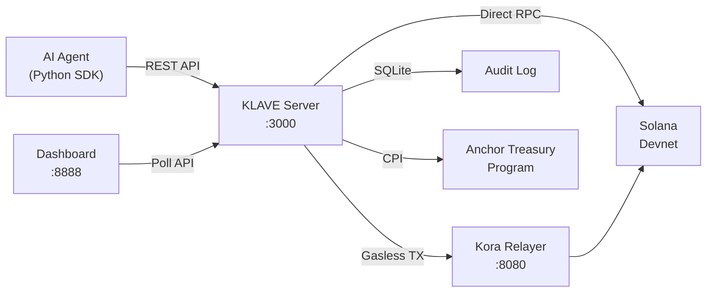

# KLAVE

**Agentic wallet infrastructure for Solana.** Create wallets for AI agents, enforce per-agent policies, execute gasless transactions, and swap tokens.

## Highlights

- **Multi-agent support** — each agent gets its own keypair, policy, and audit trail
- **Gasless transactions** — all on-chain operations routed through [Kora](https://launch.solana.com/docs/kora/operators) (no SOL needed on agent's wallet for fees)
- **Orca DeFi engine** — agents can swap tokens on Orca Whirlpools with policy-enforced slippage and volume limits
- **Policy enforcement** — per-agent spend limits, program allowlists, token restrictions, and withdrawal destinations
- **Live dashboard** — monitoring UI with real-time agent status and transaction feed
- **Python SDK** — typed async client + LangChain tool wrappers for LLM-driven agents

## Architecture



For a deep dive into the design philosophy, security model, and agent interaction patterns, see [DEEP_DIVE.md](DEEP_DIVE.md).

---

## Prerequisites

Install these before starting:

| Tool                                                        | Install                                                                                               | Purpose                                         |
| ----------------------------------------------------------- | ----------------------------------------------------------------------------------------------------- | ----------------------------------------------- |
| [Rust](https://rustup.rs/)                                  | `curl --proto '=https' --tlsv1.2 -sSf https://sh.rustup.rs \| sh`                                     | Builds the server and CLI                       |
| [Solana CLI](https://docs.solanalabs.com/cli/install)       | `sh -c "$(curl -sSfL https://release.anza.xyz/stable/install)"`                                       | Keypair management, devnet interaction          |
| [Anchor CLI](https://www.anchor-lang.com/docs/installation) | `cargo install --git https://github.com/coral-xyz/anchor avm && avm install latest && avm use latest` | Deploy the on-chain treasury program (optional) |
| [Kora](https://launch.solana.com/docs/kora/operators)       | `cargo install kora`                                                                                  | Gasless transaction relayer                     |
| Python 3.10+                                                | [python.org](https://www.python.org/downloads/)                                                       | Run the SDK and multi-agent demo                |

Make sure you have a Solana keypair configured:

```bash
solana-keygen new          # skip if you already have one
solana config set --url devnet
```

---

## Quick Start

```bash
# 1. Clone
git clone https://github.com/iamprecieee/klave.git && cd klave

# 2. Install the CLI
cargo install --path ./klave-cli

# 3. Initialize — generates .env with all secrets (JUPITER_API_KEY and LLM keys (optional) should be set manually)
klave init

# 4. Deploy the treasury program to devnet
klave deploy

# 5. Fund the Kora fee-payer (devnet). If CLI airdrop fails, use https://faucet.solana.com/ with the pubkey printed below:
solana airdrop 2 $(grep KORA_PUBKEY .env | cut -d= -f2) --url devnet

# 6. Start everything
klave start --with-kora --dashboard
```

The server is now running:

| Service          | URL                   |
| ---------------- | --------------------- |
| **KLAVE API**    | http://localhost:3000 |
| **Kora relayer** | http://localhost:8080 |
| **Dashboard**    | http://localhost:8888 |

> [!IMPORTANT]
> **API Keys:** `klave init` generates two keys in `.env`:
>
> - `KLAVE_API_KEY`: Used by agents for transactions and state queries.
> - `KLAVE_OPERATOR_API_KEY`: Used by humans/operators for administrative tasks (agent creation, policy updates).

> [!WARNING]
> **Airdrop failures:** Solana Devnet airdrops via CLI are rate-limited and often fail.
> Use the [Solana Faucet](https://faucet.solana.com/) web UI to fund addresses manually when the CLI fails.

---

## Running the Agent Demo

The demo runs an autonomous agent following the [HEARTBEAT.md](HEARTBEAT.md) playbook. It performs health checks, rebalances SOL/Vault positions, and executes token swaps based on playbook triggers.

```bash
# In a new terminal (keep klave start running in the first)

# 1. Setup the Python environment
cd sdk
uv venv
source .venv/bin/activate
uv pip install -e "./sdk[langchain]"

# 2. Run the autonomous heartbeat cycle
# The demo uses Both keys to handle initial setup (Operator) and runtime (Agent)
uv run --active klave-sdk-demo \
    --api-key $(grep KLAVE_API_KEY .env | cut -d= -f2) \
    --operator-key $(grep KLAVE_OPERATOR_API_KEY .env | cut -d= -f2)
```

The demo will print the agent's public key for funding if it has less than 0.05 SOL. Use the [Solana Faucet](https://faucet.solana.com/) to fund it if needed.

Open http://localhost:8888?key=<klave-api-key> to watch the agents in real time on the dashboard.

---

## CLI Reference

```
klave init                              # Generate .env with random secrets
klave start                             # Build + start klave-server only
klave start --with-kora                 # Also start Kora gasless relayer
klave start --dashboard                 # Also serve dashboard on :8888
klave start --with-kora --dashboard     # Everything
klave start --release                   # Production build
klave deploy                            # anchor build + deploy to devnet
klave deploy --cluster localnet         # Deploy to localnet
```

---

## Project Structure

```
klave/
├── klave-cli/          # CLI binary (init, start, deploy)
├── klave-core/         # Core library (agent registry, policy engine, audit, Kora gateway, Orca client)
├── klave-server/       # Axum HTTP server (handlers, router, middleware)
├── klave-anchor/       # Anchor treasury program (initialize_vault, deposit, withdraw)
├── sdk/                # Python SDK + multi-agent demo
│   ├── klave/          # KlaveClient, models, LangChain tools
│   ├── demo/           # multi_agent_demo.py
│   └── tests/
├── dashboard/          # Single-file HTML monitoring UI
├── docs/
│   ├── README.md       # This file
│   ├── SKILLS.md       # Agent-facing API reference
│   ├── DEEP_DIVE.md    # Design deep dive (security, architecture, trade-offs)
│   ├── REGISTER.md     # Agent self-onboarding playbook
│   └── HEARTBEAT.md    # Autonomous decision flowchart
├── .env.example        # Environment template
├── kora.example.toml   # Kora relayer configuration template
└── signers.example.toml # Kora signer pool template
```

---

## Using the Python SDK

The SDK provides a typed async client and LangChain-compatible tool wrappers.

### Install

```bash
uv venv
source .venv/bin/activate
uv pip install -e "./sdk"

# With LangChain support (optional)
uv pip install -e "./sdk[langchain]"
```

### Direct client usage

```python
from klave import KlaveClient, AgentPolicyInput

async with KlaveClient("http://localhost:3000", api_key="your-key") as client:
    # Create an agent with a policy
    agent = await client.create_agent("my-trader", AgentPolicyInput(
        allowed_programs=["11111111111111111111111111111111"],
        max_lamports_per_tx=500_000_000,
        token_allowlist=["So11111111111111111111111111111111111111112"],
        slippage_bps=100,
    ))

    # Check balance
    balance = await client.get_balance(agent.id)
    print(f"SOL: {balance.sol_lamports / 1e9}")

    # Transfer SOL
    tx = await client.transfer_sol(agent.id, "destination-pubkey", 10_000_000)
    print(f"TX: {tx.signature}")

    # Swap tokens via Orca
    tx = await client.swap_tokens(agent.id, {
        "whirlpool": "pool-address",
        "input_mint": "So11111111111111111111111111111111111111112",
        "amount": 10_000_000,
    })
```

### LangChain integration

```python
from klave import KlaveClient
from klave.tools import build_tools

client = KlaveClient("http://localhost:3000", api_key="your-key")
tools = build_tools(client)
# Pass `tools` to your LangChain agent — it can autonomously call
# create_agent, get_balance, transfer_sol, swap_tokens, etc.
```

---

## API Overview

All `/api/v1` endpoints require the `X-API-Key` header. Full reference with request/response examples is in [SKILLS.md](SKILLS.md).

### Agent lifecycle

| Method   | Endpoint                      | Description              | Key Type |
| -------- | ----------------------------- | ------------------------ | -------- |
| `POST`   | `/api/v1/agents`              | Create agent with policy | Agent    |
| `GET`    | `/api/v1/agents`              | List all agents          | Agent    |
| `DELETE` | `/api/v1/agents/{id}`         | Deactivate agent         | Operator |
| `GET`    | `/api/v1/agents/{id}/balance` | SOL + vault balance      | Agent    |
| `GET`    | `/api/v1/agents/{id}/tokens`  | SPL token balances       | Agent    |
| `GET`    | `/api/v1/agents/{id}/history` | Transaction audit log    | Agent    |
| `PUT`    | `/api/v1/agents/{id}/policy`  | Update agent policy      | Operator |

### Transactions

| Method | Endpoint                           | Description                               |
| ------ | ---------------------------------- | ----------------------------------------- |
| `POST` | `/api/v1/agents/{id}/transactions` | Execute transaction (transfer, vault ops) |

### Orca DeFi

| Method | Endpoint                         | Description                                         |
| ------ | -------------------------------- | --------------------------------------------------- |
| `GET`  | `/api/v1/orca/pools`             | Discover pools (filter by token, sort by liquidity) |
| `POST` | `/api/v1/agents/{id}/orca/quote` | Get swap quote without executing                    |
| `POST` | `/api/v1/agents/{id}/orca/swap`  | Execute token swap                                  |

### System

| Method | Endpoint  | Description            |
| ------ | --------- | ---------------------- |
| `GET`  | `/health` | Health check (no auth) |

---

## Configuration

All configuration lives in `.env`. Run `klave init` to auto-generate secrets.

| Variable               | Description                                                                                                                                                                 | Auto-generated |
| ---------------------- | --------------------------------------------------------------------------------------------------------------------------------------------------------------------------- | :------------: |
| `KLAVE_PORT`           | Server port (default: 3000)                                                                                                                                                 |       —        |
| `KLAVE_ENCRYPTION_KEY` | AES-256 key for keypair encryption at rest                                                                                                                                  |      yes       |
| `KLAVE_API_KEY`        | API authentication key                                                                                                                                                      |      yes       |
| `KLAVE_DATABASE_URL`   | SQLite path (default: `sqlite:klave.db?mode=rwc`)                                                                                                                           |       —        |
| `SOLANA_RPC_URL`       | Solana RPC endpoint (default: devnet)                                                                                                                                       |       —        |
| `KORA_RPC_URL`         | Kora relayer endpoint                                                                                                                                                       |       —        |
| `KORA_PRIVATE_KEY`     | Kora fee-payer private key (base58)                                                                                                                                         |      yes       |
| `KORA_PUBKEY`          | Kora fee-payer public key                                                                                                                                                   |      yes       |
| `KORA_API_KEY`         | Kora authentication key                                                                                                                                                     |      yes       |
| `JUPITER_API_KEY`      | Jupiter API key for SOL/USD pricing — required for `daily_spend_limit_usd` and `daily_swap_volume_usd` enforcement. Get one free at [portal.jup.ag](https://portal.jup.ag). |       —        |
| `OPENAI_API_KEY`       | OpenAI API key (optional)                                                                                                                                                   |       —        |
| `GOOGLE_API_KEY`       | Google Gemini API key (optional)                                                                                                                                            |       —        |

---

## Troubleshooting

| Problem                             | Solution                                                                                                                                                                                                                                 |
| ----------------------------------- | ---------------------------------------------------------------------------------------------------------------------------------------------------------------------------------------------------------------------------------------- |
| `solana airdrop` fails              | Use [faucet.solana.com](https://faucet.solana.com/) instead — CLI airdrops are heavily rate-limited                                                                                                                                      |
| `ProgramNotAllowed` on transactions | Add the required program IDs to the agent's `allowed_programs` policy. System Program: `11111111111111111111111111111111`, Treasury: `GCU8h2yUZKPKemrxGu4tZoiiiUdhWeSonaWCgYbZaRBx`, Orca: `whirLbMiicVdio4qvUfM5KAg6Ct8VwpYzGff3uctyCc` |
| `No .env found`                     | Run `klave init` first                                                                                                                                                                                                                   |
| Vault operations fail               | Run `klave deploy` to deploy the treasury program to devnet before using vault features                                                                                                                                                  |
| Kora offline                        | Ensure `klave start --with-kora` was used. Check `kora.log` for errors. The Kora fee-payer needs SOL for gas.                                                                                                                            |
| `TokenNotAllowed` on swap           | Add both input and output token mints to the agent's `token_allowlist` policy                                                                                                                                                            |

---

## License

MIT
